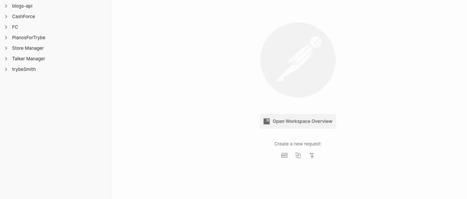
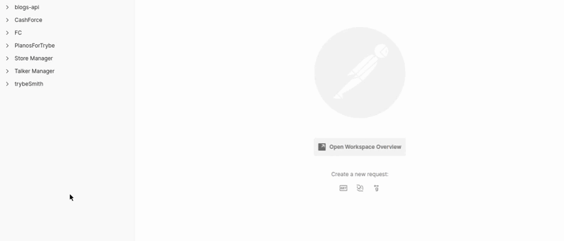
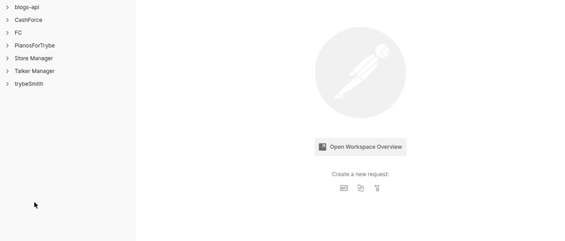
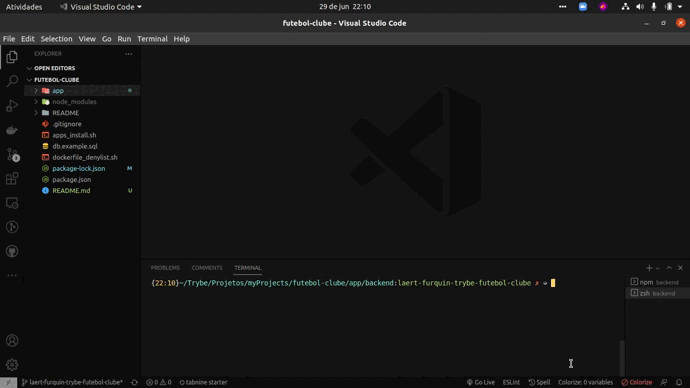

<div align="center"> 
    
</div>

<br>
<br>
<br>


<div align="center"> 
    
</div>

<br>
<br>

<div align="center"> 
    
</div>

<br>
<br>

<div align="center"> 
    
</div>

<br>
<br>

# Sumario
   - [Sobre](#sobre)
   - [Tecnologias](#tecnologias-utilizadas)
   - [Habilidades](#habilidades-desenvolvidas)
   - [Instruções](#instruções)
#

# Sobre

### Projeto desenvolvido enquanto estudante na [trybe](https://www.betrybe.com/formacao-desenvolvimento-web), os arquivos foram organizado utilizando arquitetura MSC(model, service, controller), a API se refere a um campeonato de futebol, a aplicação é dividida em 11 rotas, entre elas a de login que gera um token para autenticação do usuário, e três rotas para exibir a tabela de classificação, com base nas partidas jogadas em casa, partidas jogando como visitante e uma tabela completa com todas as partidas.o o projeto foi desenvolvido em typeScript, o que facilita para refatoração de código e conta com testes de integração cobrindo mais de 80% da aplicação.

#

# Tecnologias utilizadas
- [Postman](https://www.postman.com/)
- [MySQL Workbench](https://www.mysql.com/products/workbench/)
- [Node.js](https://nodejs.org/en/about/)
- [express](https://expressjs.com/pt-br/)
- [SQL](https://www.w3schools.com/sql/)
- [Sequelize](https://sequelize.org/)
- [TypeScript](https://www.typescriptlang.org/)
- [Mocha](https://mochajs.org/)
- [Chai](https://www.chaijs.com/)
- [Sinon](https://sinonjs.org/)
- [Docker](https://www.docker.com/)
#

# Habilidades desenvolvidas
- Criar e associar tabelas usando models do sequelize
- Construir endpoints para consumir os models que criar
- Fazer um CRUD com o ORM
- Usar ORM com pacote sequelize do npm
- Implementar aplicação utilizando TypeScript
- Realizar testes de integração
#

# Instruções

```bash
    # Clonar repositório

    $ git clone git@github.com:furquin/futebol-clube.git

    # Entrar no diretório

    $ cd futebol-clube

    # Instalar dependências

    $ npm install

    # Iniciar a aplicação com docker

    $ npm run compose:up

    # Finalizar aplicação com docker

    $ npm run compose:down

    # Iniciar a aplicação localmente

    $ cd app/backend

    $ npm run dev

    # Realizar testes de integração

    $ cd app/backend

    $ npm tets

    # Verificar cobertura de testes de integração

    $ cd app/backend

    $ npm run test:coverage


```

<br>
<br>
<br>

### Desenvolvido por [Laert Furquin](https://github.com/furquin) 

